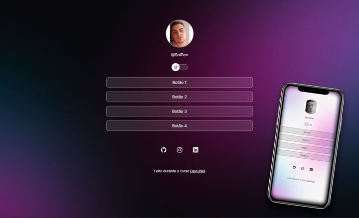

# Social Linking

Social Linking is a versatile tool that allows you to create a customized page with links to your social media profiles and other resources. It features a footer section and a theme switcher, enabling you to easily switch between light and dark modes. Additionally, you can leverage pre-existing code to modify the image or convert it to grayscale when changing themes.

## Technologies

* HTML and CSS
* Git and Github
* JS
* Figma

## Features

- **Customizable Links** : Effortlessly add links to your social media profiles, portfolio, blog, or any other important content.
- **Footer** : Include additional information such as a brief biography, contact details, or any message you wish to display in the footer section of the page.
- **Theme Switcher** : Toggle between light and dark themes with just one click, enhancing the viewing experience for your visitors.
- **Image Customization** : Utilize pre-existing code to modify the image or apply grayscale effects when transitioning between themes.

## Preview

## Getting Started

To use Social Linking, follow these steps:

1. Clone the repository: `git clone https://github.com/g-soldera/social-linking.git`.
2. Open the project in your preferred code editor.
3. Customize the links by modifying the appropriate sections in the code.
4. Optionally, update the footer information to reflect your desired content.
5. Test the project locally to ensure everything functions as intended.
6. Deploy the project to your preferred hosting platform.
7. Share your Social Linking page with others and enjoy the streamlined navigation to your various online profiles.

## Customization

Social Linking offers various customization options to tailor the page according to your preferences:

- **Link Customization** : Update the links in the code to match your social media profiles and other resources.
- **Footer Content** : Modify the footer section to display your desired information, such as a biography or contact details.
- **Theme Customization** : Adjust the colors, styles, and layout to create a personalized look and feel.
- **Image Modification** : Use the provided code snippets to modify the image or apply grayscale effects when switching themes.

## Contributing

Contributions are welcome! If you have any ideas, suggestions, or bug reports, please feel free to open an issue or submit a pull request.

## License

This project is licensed under the [MIT License](https://chat.openai.com/c/LICENSE), making it open and free for anyone to use and modify.

## Acknowledgements

- Ionic Icons - https://ionic.io/ionicons
- DevLinks - https://rocketseat.com.br

## Contact

If you have any questions or need assistance, please feel free to reach out to me at [gustavo.soldera@gmail.com].
